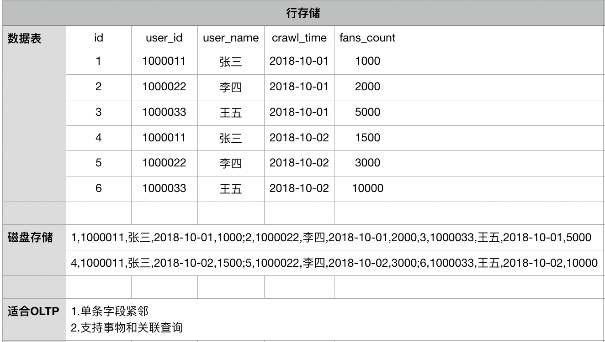
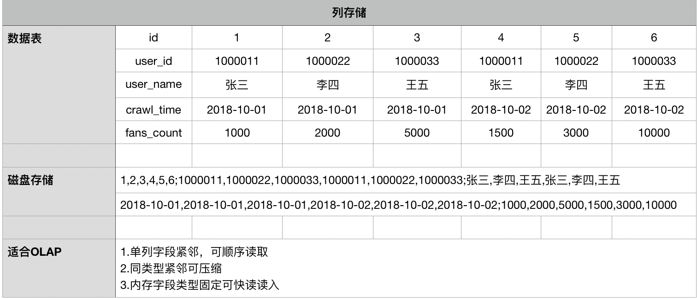
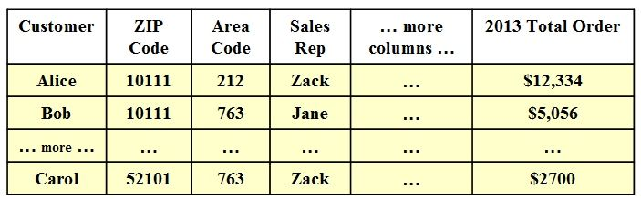
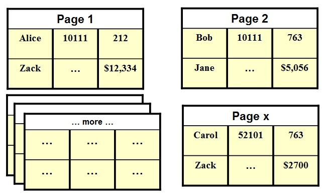
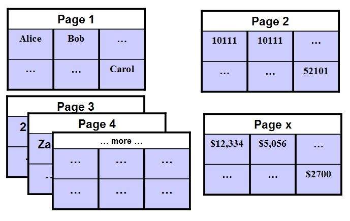
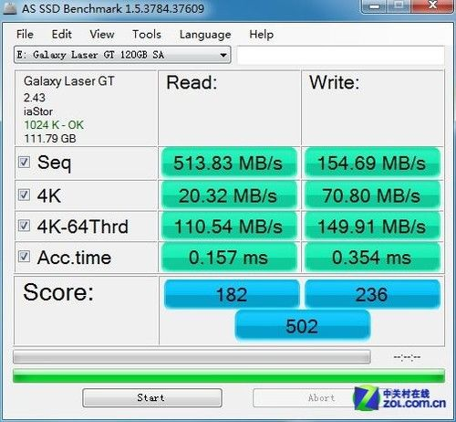

# 行与列式数据库

- 作者：codehackfox@gmail.com
- 时间：2018-08-10 13:23:49

> ### 0x00、简介

> ##### 行式数据库

- 平常用的结构化关系型数据库，比如mysql、sqlserver等
- 一行为一条数据，进行记录存储
- 可以进行join查询，可以进行笛卡尔积运算

> ##### 列式数据库

- 列式数据库是以列相关存储架构进行数据存储的数据库，主要适合于批量数据处理和即时查询。相对应的是行式数据库，数据以行相关的存储体系架构进行空间分配，主要适合于小批量的数据处理，常用于联机事务型数据处理。
- 特点
    - 因为硬盘寻址时间相较于计算机上其他部件的运行速度来说不是一般的慢，所以常用相同工作负载下的硬盘访问性能来比较行数据库和列数据库。通常，顺序读取数据要比随机访问更快。而且，硬盘寻址时间的提升比起CPU速度的进步要慢得多 (参看 摩尔定律)，在使用硬盘作为存储媒介的系统上这种情况很可能还会持续一段时间。下面简单罗列了一些选择行数据库还是列数据库的权衡依据。当然，如果能够把数据全放在内存中，那么使用内存数据库性能会更好。
        - 1.在只需要根据某几列来聚合数据的时候按列的数据组织方式更有效。因为这样只需要读取一部分数据，要比读取全部数据更快。
        - 2.当只需要修改某一列值的时候按列的数据组织方式更有效。因为可以直接找到某列数据并修改，而与行中的其他列无关。
        - 3.当需要某行的多列数据的时候按行的数据组织方式更有效。当行中数据不是太多的情况下一次硬盘寻址就可以获得该行的所有数据。
        - 4.在新增行数据的时候，如果各列都有值，那么按行的数据组织方式会更有效，因为只需要一次硬盘寻址就可以写入整行的全部数据。

> ##### 应用

- 面向行的数据存储架构更适用于OLTP-频繁交互事务的场景。
- 面向列的数据存储架构更适用于OLAP-(如数据仓库)这样在海量数据（(可能达到 terabyte规模)）中进行有限复杂查询的场景。

> ### 0x01、比较

-  
- 
- 底层存储实例
    - 
    - 
    - 
- 随机读与顺序读
    - 
> ### 0x02、优缺点

- ##### 列数据库
    - 优点：
        * 极高的装载速度（最高可以等于所有硬盘IO 的总和，基本是极限了）
        * 适合大量的数据而不是小数据
        * 实时加载数据仅限于增加（删除和更新需要解压缩Block 然后计算然后重新压缩储存
        * 高效的压缩率，不仅节省储存空间也节省计算内存和CPU。
        * 非常适合做聚合操作。
    - 缺点：
        * 不适合扫描小量数据
        * 不适合随机的更新
        * 批量更新情况各异，有的优化的比较好的列式数据库（比如Vertica）表现比较好，有些没有针对更新的数据库表现比较差。
        * 不适合做含有删除和更新的实时操作
- ##### 行数据库
    - 优点
        * 适合频繁的增删改数据
        * 小量数据的频繁维护和简单统计
    - 缺点
        * 不适合做统计类操作 

