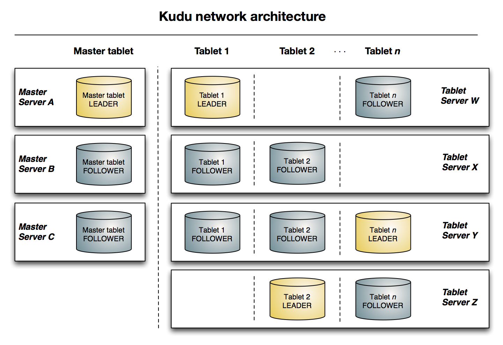

# kudu简介

- 作者：codehackfox@gmail.com
- 时间：2019-07-12 10:13:23

* [总体概览](#0x00、总体概览)
* [设计模式](#0x01、设计模式)
* [存储结构](#0x02、存储结构)
* [读写流程](#0x03、读写流程)
* [impala结合](#0x04、impala结合)
* [限制条件](#0x05、限制条件)
* [文档资源](#0x06、文档资源)


> ## 0x00、总体概览

### 1.历史发展
* 2012年10月由Cloudera公司发起创建,2015年10月对外公布，2015年12月进入apache基金会进行孵化，后续进入快速发展轨道。

### 2.产品定位
* Fast Analytics on Fast Data。

### 3.产生之前

在kudu之前的数据分类为：
* 静态数据
    * 以HDFS引擎作为存储引擎，适⽤用于⾼吞吐量的离线大数据分析场景
    * 这类存储的局限性是数据无法进行行随机的读写
* 动态数据
    * 以HBase、Cassandra 作为存储引擎，适⽤用于⼤大数据随机读写场景
    * 这类存储的局限性是批量量读取吞吐量量远不不如 HDFS，不不适⽤用于批量量数据分 析的场景
而既要满足随机读写和大数据分析的解决方案如下


而以上的方案问题是：
* 架构复杂
    * 流转涉及环节太多，运维成本很高
    * 每个环节需要保证高可用，需要维护多个副本，存储空间也有一定的浪费
    * 数据在多个系统上，对数据安全策略、监控等都提出了挑战
* 时效性低
    * 从 HBase 导出成静态文件是周期性
* 难以应对后续的更新
    * 已经从 HBase 导出到 HDFS，新到的变更数据就难以处理
所以产生了新的解决方案，那就是kudu，其定位如下：

而其gap了hdfs和hbase之间的


### 4.架构图
kudu的整体架构图如下


### 5.基本概念
下面了解一些kudu里的一些基本概念。
* Table
    * 数据存储，没有库的概念
    * 有对应的schema结构
    * 字段是强类型
    * 需要设置主键
    * 分隔为N个tablets
* Tablet
    * Table按照行切分后存储的位置
    * 一个tablet会多副本到其他server上，并且有一个会是leader
    * 如果leader失效，会用raft一致性协议重新选举
    * 任何一组副本内的tablet都可以读，但是只能从leader写入
* Mater
    * 持续追踪所有的tablet、tablet server、catalog table、其他的集群meta信息
    * 可以部署多个master，但只有一个是active
    * 如果active时效了，用raft协议在选举出一个
    * Master信息也会存储在一个tablet上，并且被复制同步到其他master机器上
    * Tablet servers会发送心跳包到master机器(默认是一秒一次)
* Tablet Server
    * 用来存储tablet数据并且向client提供服务
    * 一个tablet会在多个tablet server上
    * 一个tablet server会有多个tablet
* Catelog table
    * 是kudu元数据的中心，存储了关于table和tablet的信息
    * 不允许被直接读写
    * table
        * table schemas,
        * Locations
        * states
    * tablet
        * Tablet list
        * Tablet server上有哪些tablet
        * States
        * Start and end keys
* Raft一致性协议算法
    * 分布式服务高可用性进行多副本
    * 通过raft来选举出leader
    * 多副本数据都可以读，但只有leader可以写
    * 写入时只有当大多数follower确认成功，才算写入成功
    * 在一组副本中(通常是3或5个)，允许有(N-1)/2的失败

### 6.使用场景
* 流式实时计算
    * 流式计算场景通常有持续不断地大量写入
    * 与此同时这些数据还要支持近乎实时的读、写以及更新操作
* 时间序列存储
    * hash分片设计能够很好地避免TSDB类请求的局部热点问题
    * 高效的Scan性能让Kudu能够比Hbase更好的支持查询操作
* 历史数据共存
    * Impala可以同时支持HDFS、Kudu等多个底层存储引擎
    * 不必把所有的数据都迁移到Kudu

> ## 0x01、设计模式

### 1.数据类型
* boolean
* 8-bit signed integer
* 16-bit signed integer
* 32-bit signed integer
* 64-bit signed integer
* unixtime_micros (64-bit microseconds since the Unix epoch)
* single-precision (32-bit) IEEE-754 floating-point number
* double-precision (64-bit) IEEE-754 floating-point number
* decimal (see Decimal Type for details)
* UTF-8 encoded string (up to 64KB uncompressed)
* binary (up to 64KB uncompressed)

### 2.主键设计
* 单列或多列
    * 可以设置一列为主键，也同时设置多列为主键
* 唯一性
    * 数据是全表唯一的
* 不可被更改性
    * 在schema建成后，主键不能够修改
    * 其值不能被更改，不同即新增
* 主键索引
    * 为主键建立B+索引

### 3.分区设计(Partition)
* 表分区类型
    * hash
        * 按照某一个或几个值的hash进行分区
        * 可指定分区的个数
    * range
        * 按照某一个字段值的范围分区
        * 可以动态的增删
    * multilevel
        * 可以同时按照hash、range结合来分区
        * 既分散热点数据又可动态增删
* 比如建立如下一个表
```sql
CREATE TABLE metrics (
    host STRING NOT NULL,
    metric STRING NOT NULL,
    time INT64 NOT NULL,
    value DOUBLE NOT NULL,
    PRIMARY KEY (host, metric, time),
);
```
* 按照range来分区如下

* 按照hash分区如下

* 同时按照range和hash来分区

* 同时按照hash和hash来分区


* 那么hash与range的优缺点是


### 4.字段编码
* 编码的类型如下

* 每中字段适用及默认的编码类型如下


### 5.数据压缩
* 编码类型有一下几种
    * LZ4
        * 可以设置为默认
    * zlib
    * snappy

> ## 0x02、存储结构

* 逻辑结构图如下

*

> ## 0x03、读写流程

### 1.锁类型
* 共享锁(读锁)
    * 获得后只能够进行读操作
    * 其他读可以，任何写等待
* 互斥锁(写锁)
    * 只能获得锁的对象进行写
    * 任何读等待，其他写等待
* MVCC(Multi-Version Concurrency Control)
    * 每一个写操作都会创建一个新版本的数据
    * 读操作会从有限多个版本的数据中挑选一个最合适的结果直接返回
    * 读写操作之间的冲突就不再需要被关注，而管理和快速挑选数据的版本就成了 MVCC 需要解决的主要问题。

### 2.存储数据


fluash示例如下


### 3.compaction


### 4.kudu api


> ## 0x04、impala结合

### 1.功能简介
* 支持存储
    * HDFS、Hbase、Kudu、Hive
    * csv、file
* 结构概念
    * 库、表、视图、角色
    * 权限、函数
* 多种类型
    * array、bigint、boolean、char
    * map、struct

### 2.表的概念
* 内部表
    * 通过impala创建的表都是内部表(internal)
    * 修改表结构对应的底层表也会进行变动
    * 删除表底层表也删除
* 外部表
    * 不同过impala创建的表都是外部表(external)
    * 要操作这些表，需要在impala建立表的映射关系
    * 通过sql修改表结构或者删除表不会删除底层表，删除的只是表的映射关系

### 3.建表示例


### 4.属性操作


### 5.常用操作


### 6.python api


> ## 0x05、限制条件

### 1.表限制
* 表的备份数必须为奇数，最⼤大为7
* 备份数在设置后不不可修改
* 删除表后空间会⽴立⻢马释放
* 建表时partition总数限制为60个，后续可以添加

### 2.列限制
* 部分数据类型不支持，如CHAR, VARCHAR, DATE, ARRAY等
* 数据类型以及是否可为空等列列属性不支持修改
* 一张表最多有300列列
* 删除列列的时候不会立马清除空间，需要执⾏Compaction操作，但是 Compaction操作不⽀持手动执行

### 3.主键限制
* 表创建后主键不不可更更改
* 主键字段必须在其他字段之前定义
* ⼀行对应的主键内容不可以被Update操作修改。要修改⼀行的主键值，需 要删除并新增⼀行新数据，并且该操作无法保持原子性
* 主键的类型不支持DOUBLE、FLOAT、BOOL，且必须是非空的(NOT NULL)
* 不支持⾃自动⽣生成主键
* 每行对应的主键存储单元(CELL)最⼤为16KB

### 4.单元限制
* 单元对应的数据最⼤大为64KB，并且是在压缩前

### 5.分片限制
* 分⽚只支持手动指定，⾃自动分⽚不支持
* 分片设定不不⽀支持修改，修改分⽚设定需要”建新表-导数据-删老表”操作;
* 丢掉多数备份的Tablets需要⼿手动修复。
* Range⽀持删除或新增

### 6.容量建议
* 建议tablet servers的最⼤大数量量为100;
* 建议masters的最⼤大数量量为3;
* 建议每个tablet server存储的数据最大为8T
* 每个tablet server存储的tablets数量建议在1000以内;
* 每个表分片后的tablets存储在单个tablet server的最⼤大数量为60。

### 7.Impala集成限制
* 不支持varchar、array、map、struct等类型
* Impala⼤小写不不敏敏感，kudu是⼤小写敏敏感，所以表名及字段最好都是小写
* !=和like查询是kudu把数据全部给impala，然后在过滤的，相⽐其他操作效率要低
* Updates、inserts、deletes都是⾮非事务的
* 一条sql的并发执⾏行行数在于tablets的个数，所以推荐⾄至少有10个tablets

### 8.其他限制
* 主键有索引，不支持⼆级索引(Secondary indexes)
* 不支持多⾏行行的事务操作
* 关系型数据的一些功能，如外键，不支持;
* 列和表的名字强制为UTF-8编码，并且最大256字节

> ## 0x06、文档资源

* <https://kudu.apache.org/kudu.pdf>
* <https://www.cloudera.com/documentation/enterprise/latest/PDF/cloudera-kudu.pdf>
* <https://kudu.apache.org/docs/>
* <https://github.com/apache/kudu/blob/master/docs/design-docs/tablet.md>
* <https://github.com/apache/kudu/blob/master/docs/design-docs/cfile.md>
* <https://raft.github.io/raft.pdf>
* <https://impala.apache.org/docs/build/impala-2.8.pdf>
* <https://www.cloudera.com/documentation/enterprise/5-10-x/topics/impala_tutorial.html>