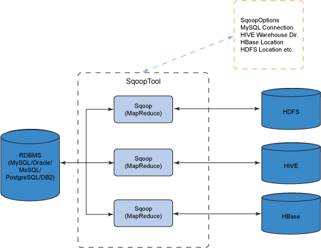
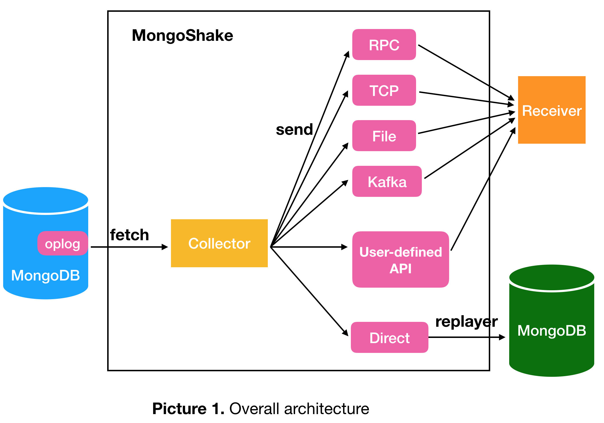

# 数据同步工具

- 作者：codehackfox@gamil.com
- 时间：2019-09-06 22:10:12

## 0x00、总览

* 1.定时任务
* 2.canal/otter
* 3.Datax
* 4.Sqoop
* 5.NiFi
* 6.mongoshake

## 0x02、定时任务

定时任务工具是作为数据同步的最基本也是最常用的工具。其不但用于定时的数据同步，而且作为定时的处理其他任务，比如爬虫等。

### 1.[Airflow](https://airflow.apache.org/)

### 2.[gocron](https://github.com/ouqiang/gocron)

## 0x03、cannel/otter

* 阿里巴巴分布式数据库同步系统
* [官网](https://github.com/alibaba/otter)
* 主要同步mysql数据，读取解析mysql binlog，然后同步导入到新的mysql库内

## 0x04、Datax

* 阿里巴巴开源离线同步Datax
* [官网](https://github.com/alibaba/DataX)
* 抽象为读取的reader源和写入的write源，支持开发新插件
* 直接读取写入，用json格式来描述，不支持中间做转换

## 0x05、Sqoop

* <https://sqoop.apache.org/>
* <https://github.com/apache/sqoop>
* 定位是从hadoop与关系型数据库的同步。
* Sqoop 启用了一个 MapReduce 作业（极其容错的分布式并行计算）来执行任务
* Sqoop 的另一大优势是其传输大量结构化或半结构化数据的过程是完全自动化的。
* 

## 0x06、Nifi

* NiFi 项目在创建过程中遵循了一些理念
    * 1）精细化管理信息流的能力；
    * 2）跟踪数据相关事件和信息的能力，比如数据从哪里来，在路径中发生了什么；
    * 3）保证控制和数据面的安全能力
* 优势
    * 有保证的数据交付
    * 支持背压（back-pressure）机制的数据缓冲
    * 有优先级的队列
    * QoS
    * 数据溯源（Data provenance）：NiFi 对数据流路径上的每次变化都会保留日志记录，从而保证结果的可追溯，以及数据的恢复、重播、审计和评估。
    * 通过日志记录数据的历史细节
    * 支持交互式命令和控制台，并对系统变化提供可视化的反馈
    * 支持流模板（Flow templates）
    * 支持插入式（Pluggable）/ 多角色（multi-role）的安全机制
    * 支持对数据操作的扩展
    * 支持集群管理

## 0x07、mongoshake

* <https://github.com/alibaba/MongoShake>
* alibaba开源的同步mogndb的服务
* 